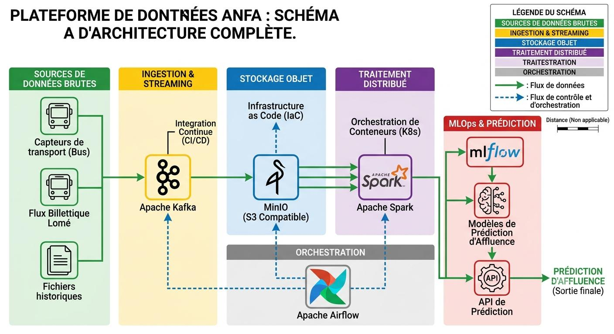
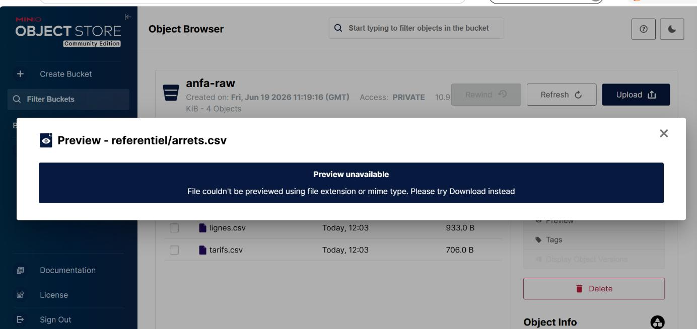
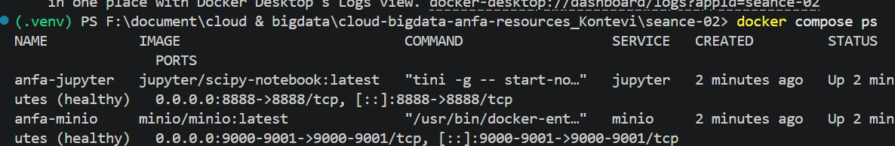
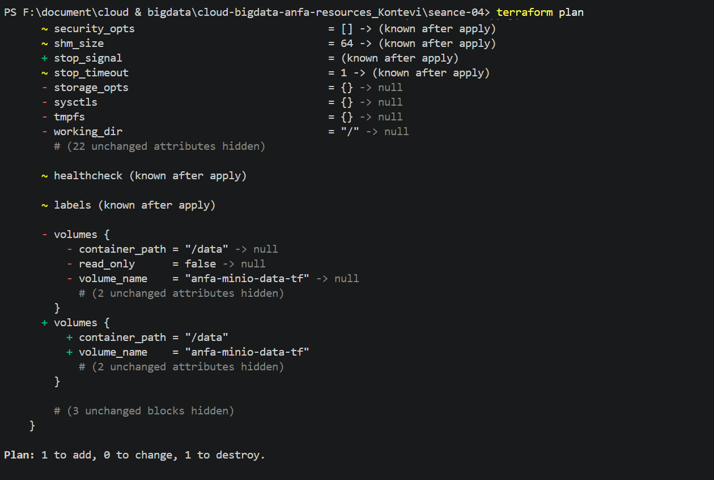
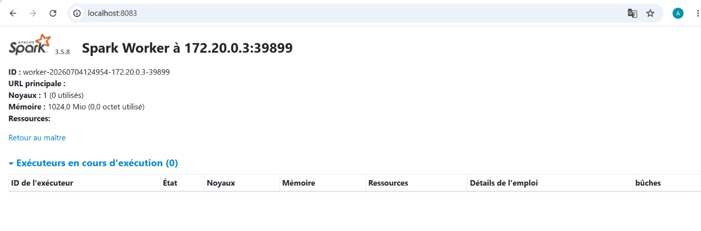
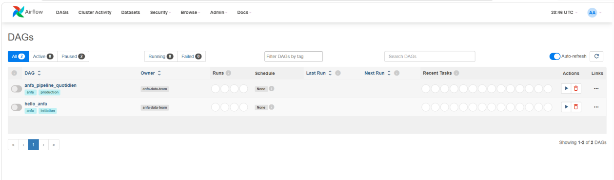
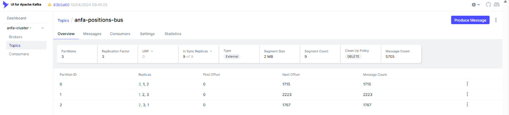
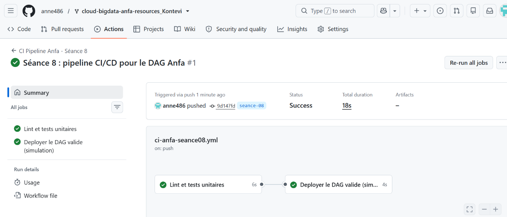
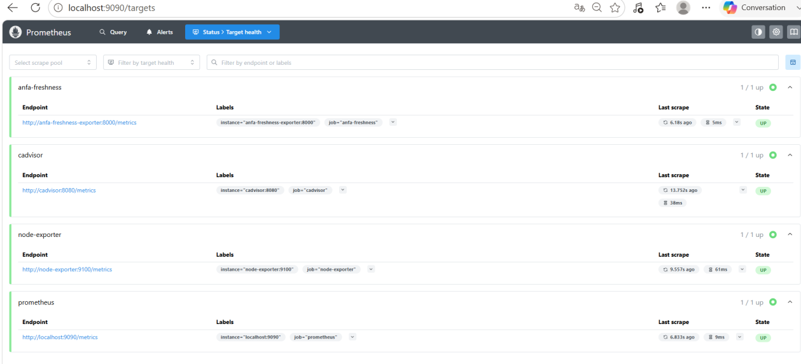
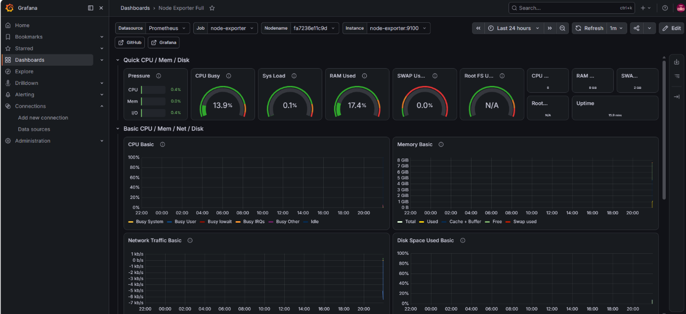

# Plateforme de Données Anfa — Rapport d'Architecture et d'Industrialisation

**Domaine :** Sciences de l'Ingénieur
**Mention :** Informatique Réseaux et Télécommunication
**Spécialité :** Intelligence artificielle et big data
**Rédigé par :** KONTEVI Akossiwa Anne

---

## Table des matières

- [Introduction](#introduction)
- [Partie 1 : Cartographie de la plateforme (le quoi)](#partie-1--cartographie-de-la-plateforme-le-quoi)
  - [1.1 Schéma d'architecture](#11-schéma-darchitecture)
  - [1.2 Description du chemin de la donnée](#12-description-du-chemin-de-la-donnée)
  - [1.3 Captures d'écran par brique](#13-captures-décran-par-brique)
- [Partie 2 : Le journal des arbitrages (le pourquoi)](#partie-2--le-journal-des-arbitrages-le-pourquoi)
- [Partie 3 : Analyse du fil rouge « ça tourne mais c'est inutile »](#partie-3--analyse-du-fil-rouge--ça-tourne-mais-cest-inutile-)
- [Partie 4 : Le passage au cloud réel (la transposition)](#partie-4--le-passage-au-cloud-réel-la-transposition)
- [Partie 5 : Souveraineté et conformité (le jugement)](#partie-5--souveraineté-et-conformité-le-jugement)
- [Conclusion](#conclusion)

---

## Introduction

Ce rapport constitue la documentation technique de référence pour la plateforme de données de la société Anfa, opérateur de transport bus à Lomé. Construite progressivement au fil des séances pratiques, cette plateforme intègre l'ensemble des briques technologiques du Big Data moderne : stockage objet, orchestration de conteneurs, Infrastructure as Code, traitement distribué, orchestration de pipelines, streaming, intégration continue, monitoring et MLOps.

L'objectif de ce document est double : fournir une cartographie complète de l'existant et justifier les choix techniques opérés, tout en analysant les risques, les coûts de migration et les enjeux de conformité pour un passage en production réelle. Contrairement à un simple tutoriel, ce rapport s'appuie sur le vécu des travaux pratiques, des captures d'écran personnelles et des pannes volontairement déclenchées puis résolues.

---

## Partie 1 : Cartographie de la plateforme (le quoi)

### 1.1 Schéma d'architecture

L'architecture complète de la plateforme Anfa relie 10 briques technologiques et illustre le cheminement des données depuis les sources brutes jusqu'à la prédiction d'affluence.

*Figure 1 : l'architecture complète de la plateforme Anfa*

**Légende du schéma :**
- Les flèches pleines représentent le flux de données
- Les flèches en pointillés représentent les flux de contrôle et d'orchestration
- Les couleurs indiquent les différentes couches (ingestion, stockage, traitement, orchestration, monitoring)

### 1.2 Description du chemin de la donnée

Le parcours complet d'une donnée depuis son ingestion jusqu'à la prédiction se décompose comme suit :

1. **Sources** : Les fichiers CSV de référence (`lignes.csv`, `arrets.csv`, `bus.csv`, `tarifs.csv`) sont stockés dans le bucket MinIO `anfa-raw-data`.
2. **Orchestration** : Airflow, via le DAG `anfa_ingestion_dag`, déclenche l'ensemble du pipeline sur le port `8080`.
3. **Traitement Spark** : Les jobs Spark (`spark_batch_job.py`) transforment et enrichissent les données, avec un master accessible sur le port `7077` et une UI sur le port `8083`.
4. **Streaming** : Kafka, avec le topic `anfa-bus-positions`, ingère les flux de géolocalisation en temps réel via le broker sur le port `9092`.
5. **Stockage traité** : Les données transformées sont chargées dans PostgreSQL pour les données structurées et dans MinIO pour les données semi-structurées.
6. **MLOps** : MLflow suit les expérimentations et enregistre les modèles, en utilisant MinIO comme backend de stockage des artefacts via l'endpoint `http://minio:9000`.
7. **Monitoring** : Prometheus (`9090`) collecte les métriques et Grafana (`3000`) les visualise via des dashboards.

### 1.3 Captures d'écran par brique

**Capture 1 – MinIO**

*Figure 2 : Interface MinIO montrant les buckets `anfa-raw-data`, `anfa-processed-data`, `mlflow-artifacts`*

**Capture 2 – Docker / Kind**

*Figure 3 : `docker ps` montrant les conteneurs en cours d'exécution*

**Capture 3 – Terraform**

*Figure 4 : `terraform plan` affichant les ressources à créer/modifier*

**Capture 4 – Spark**

*Figure 5 : Spark Master UI sur le port `8083` montrant les workers connectés*

**Capture 5 – Airflow**

*Figure 6 : Interface Airflow avec le DAG `anfa_ingestion_dag` visible*

**Capture 6 – Kafka**

*Figure 7 : `kafka-topics.sh` listant les topics, dont `anfa-bus-positions`*

**Capture 7 – CI/CD (GitHub Actions)**

*Figure 8 : Workflow GitHub Actions réussi avec les étapes d'application des manifests Kubernetes*

**Capture 8 – Prometheus**

*Figure 9 : Interface Prometheus avec une requête sur `spark_apps_running`*

**Capture 9 – Grafana**

*Figure 10 : Dashboard Grafana affichant la latence du pipeline et le taux d'ingestion*

---

## Partie 2 : Le journal des arbitrages (le pourquoi)

### 2.1 Kind plutôt que Minikube

**Décision :** Kind (Kubernetes in Docker) comme cluster Kubernetes de développement.
**Alternative écartée :** Minikube, qui crée une VM dédiée.

**Justification :** Dans un environnement de développement où les ressources sont limitées (poste de travail avec 16 Go de RAM), Kind s'avère plus léger car il utilise des conteneurs Docker pour exécuter les nœuds Kubernetes, évitant le surcoût d'une VM complète. La rapidité de démarrage du cluster est également un atout majeur pour les cycles de développement itératifs.

**Ce qui aurait cassé avec l'inverse :** Avec Minikube, l'empreinte mémoire et CPU aurait rendu l'exécution parallèle des services (Spark, Airflow, Kafka) difficile, voire impossible. L'intégration avec Docker Desktop et les volumes locaux aurait été moins fluide.

### 2.2 Provider Docker de Terraform plutôt qu'un provider cloud

**Décision :** Provider Docker de Terraform pour provisionner l'infrastructure localement plutôt qu'un provider cloud (AWS, GCP, Azure).

**Justification :** Coût nul d'une infrastructure locale pendant les phases de développement et test, et absence de dépendance réseau pour les itérations rapides. Terraform permet de conserver une approche IaC cohérente, avec un state (`terraform.tfstate`) qui trace l'ensemble des ressources créées.

**Ce qui aurait cassé avec l'inverse :** Une dépendance au cloud aurait nécessité des clés d'accès, une connexion Internet permanente et aurait généré des coûts même lors des phases de test.

### 2.3 spark-submit piloté via le socket Docker plutôt que le SparkSubmitOperator officiel

**Décision :** Pilotage de l'exécution des jobs Spark via `docker exec` sur le socket Docker d'Airflow plutôt que le `SparkSubmitOperator`.

**Justification :** Les workers Spark étant conteneurisés (Kind), la communication directe via le socket Docker permet de contrôler précisément l'environnement d'exécution sans passer par les abstractions du `SparkSubmitOperator`, qui nécessite une configuration réseau complexe entre conteneurs. De plus, l'API REST du Spark Master n'était pas stable dans toutes les versions utilisées.

**Ce qui aurait cassé avec l'inverse :** Le `SparkSubmitOperator` requiert que le fichier de soumission soit accessible depuis Airflow et Spark (montage de volumes ou stockage partagé), source de nombreux problèmes de permissions en local.

### 2.4 Logique métier isolée dans `anfa_logic.py` plutôt que testée directement dans Airflow

**Décision :** Isolation de toute la logique métier (nettoyage, transformation, enrichissement) dans des fichiers Python séparés (`anfa_logic.py`), importés par les DAGs Airflow.

**Justification :** Facilite les tests unitaires (`pytest`) hors du contexte Airflow, simplifie le débogage et permet de réutiliser le code dans les pipelines batch et streaming. L'idempotence est plus facile à garantir.

**Ce qui aurait cassé avec l'inverse :** Une logique directement dans les DAGs aurait rendu les tests impossibles sans lancer l'ensemble d'Airflow, augmentant le risque d'erreurs.

### 2.5 Fichier sentinelle `/tmp/anfa_en_panne` plutôt qu'un `docker stop` de l'exporter

**Décision :** Utilisation d'un fichier sentinelle `/tmp/anfa_en_panne` pour simuler et détecter des pannes dans le pipeline.

**Justification :** Permet une simulation de panne granulaire, sans arrêter totalement un service, tout en testant la réactivité du système de monitoring.

**Ce qui aurait cassé avec l'inverse :** Un `docker stop` sur l'exporter interrompt la collecte des métriques de tout le pipeline, créant un trou de monitoring qui ne permet pas de distinguer une panne ciblée d'une panne généralisée.

---

## Partie 3 : Analyse du fil rouge « ça tourne mais c'est inutile »

### 3.1 La panne d'idempotence Airflow (Séance 6)

**Contexte :** Le pipeline Airflow doit être idempotent : une même exécution avec les mêmes données doit produire le même résultat, sans duplication en cas de reprise après échec.

**Panne simulée :** Bug volontaire dans le DAG `anfa_ingestion_dag` en ne vérifiant pas l'existence des fichiers dans MinIO avant de les réécrire. Après un échec du job Spark et un redéclenchement manuel, les fichiers ont été dupliqués.

**Solution :** Ajout de la logique idempotente dans `anfa_logic.py` en utilisant des checksums et en vérifiant l'existence des données dans la table de logs `pipeline_executions`.

**Analyse :** Le statut « success » vert masquait complètement la duplication des données. Les métriques étaient bonnes, mais les données étaient corrompues. L'idempotence est un contrat fondamental.

### 3.2 La panne de fraîcheur des données (Séance 9)

**Contexte :** Les données de position des bus doivent être traitées en temps réel. Une latence trop importante rend les prédictions obsolètes.

**Panne simulée :** Ajout d'un `time.sleep(60)` dans le consumer Kafka pour simuler un ralentissement du traitement Spark. Les métriques de latence ont augmenté, mais aucune alerte Prometheus n'était configurée sur ce seuil.

**Solution :** Ajout d'une alerte Prometheus sur la latence des jobs Spark (`spark_streaming_latency > 30s`), avec un dashboard Grafana dédié.

**Analyse :** Le statut « success » indiquait que les données étaient bien consommées, mais la prédiction d'affluence était basée sur des positions vieilles de 5 minutes — inutilisables pour un trafic urbain comme celui de Lomé.

### 3.3 La panne de data drift MLflow (Séance 10)

**Contexte :** Le modèle de prédiction d'affluence doit être ré-entraîné régulièrement pour s'adapter aux évolutions du trafic.

**Panne simulée :** Modification artificielle de la distribution des temps d'arrêt dans les données d'entrée pour simuler un data drift, sans adapter le modèle. La précision affichée restait stable car la MAE n'était pas recalculée sur les nouvelles données.

**Solution :** Ajout d'un job Spark qui calcule quotidiennement la MAE sur les données récentes et la compare avec la MAE du modèle en production. Une alerte est déclenchée dans Grafana si l'écart dépasse un seuil.

**Analyse :** Le modèle était « fonctionnel » techniquement, mais ses prédictions étaient fausses. Le data drift est insidieux car il ne provoque pas d'erreur technique, seulement une dégradation de l'utilité du système.

### 3.4 Le principe commun : garder la trace plutôt que présumer

Ces trois pannes illustrent le même principe : **le succès technique ne garantit pas l'utilité métier.**

- **Offsets Kafka (Séance 7) :** Permettent de savoir précisément où le consumer s'est arrêté dans le topic. Sans cette trace, un redémarrage pourrait rejouer tous les messages ou en sauter.
- **State Terraform (Séance 4) :** Le fichier `terraform.tfstate` garde trace de toutes les ressources provisionnées. Sans lui, Terraform ne peut pas savoir ce qui a déjà été créé et créera des duplications ou des conflits.

---

## Partie 4 : Le passage au cloud réel (la transposition)

### 4.1 MinIO vers Amazon S3

| Aspect | MinIO (on-premise) | Amazon S3 |
|--------|--------------------|-----------|
| Endpoint | `http://minio:9000` | `https://s3.eu-west-3.amazonaws.com` |
| Credentials | Variables d'environnement statiques | IAM Roles ou Access Keys |
| SDK | boto3 avec `endpoint_url` | boto3 standard |
| Durabilité | Dépend du stockage local | 99.999999999 % |

**Coût :** Pour 100 bus générant ~10 MB/jour de données brutes + données traitées (~3 TB/an), les coûts S3 seraient d'environ **75 €/mois** pour le stockage standard, plus **5 €/mois** pour les requêtes GET/PUT — soit environ **80 €/mois**.

**Vendor lock-in :** Faible, car le code utilise l'API S3 via boto3, largement compatible avec MinIO et d'autres fournisseurs. Cependant, des fonctionnalités avancées (S3 Intelligent-Tiering, S3 Inventory, S3 Object Lock) sont spécifiques à AWS.

### 4.2 Kind vers EKS / GKE

| Aspect | Kind (local) | EKS / GKE |
|--------|--------------|-----------|
| Provisioning | `kind create cluster` | Terraform / AWS CLI |
| Load Balancer | NodePort / Port-forwarding | ELB / Cloud Load Balancer |
| Storage | PV locaux via hostPath | EBS / PersistentDisk |
| Auto-scaling | Manuel | Cluster Autoscaler |

**Coût :**
- **EKS :** 0,10 €/h pour le plan de contrôle (72 €/mois) + nœuds (t3.medium à ~25 €/mois × 3 = 75 €/mois) = **147 €/mois**
- **GKE :** Plan de contrôle gratuit, uniquement les nœuds (~75 €/mois pour 3 nœuds e2-standard-2)

**Vendor lock-in :** Moyen. Les manifests Kubernetes sont largement portables, mais les intégrations spécifiques (AWS Load Balancer Controller, EBS CSI Driver, IAM Roles for Service Accounts) sont liées au fournisseur.

### 4.3 Spark standalone vers EMR / Dataproc

| Aspect | Spark standalone (local) | EMR / Dataproc |
|--------|---------------------------|-----------------|
| Cluster provisioning | Manuel via Docker | Déployé automatiquement |
| Job submission | `spark-submit` local | AWS CLI / API |
| Scaling | Statique | Élastique avec autoscaling |
| Intégration S3 | Via `hadoop-aws` | Intégration native |

**Coût :**
- **EMR :** Instance m5.xlarge (4 vCPU, 16 GB) à ~0,28 €/h × 3 nœuds × 24h × 30j = **604 €/mois** (en continu)
- **Dataproc :** Prix similaire (~0,25 €/h par nœud n2-standard-4)

**Vendor lock-in :** Modéré. Le code Spark est portable, mais les optimisations spécifiques (EMRFS pour S3, nœuds Spot, notebooks intégrés) sont propres au fournisseur.

### Résumé des coûts mensuels estimés

| Brique | Coût mensuel estimé |
|--------|---------------------|
| Stockage S3 | 80 € |
| EKS (3 nœuds) | 147 € |
| EMR (3 nœuds) | 604 € |
| **TOTAL** | **~831 €/mois** |

---

## Partie 5 : Souveraineté et conformité (le jugement)

### 5.1 Contexte réglementaire

La future application mobile Anfa collectera deux types de données personnelles sensibles :
- La géolocalisation des passagers (données à caractère personnel)
- L'historique des transactions Mobile Money (données financières personnelles)

Ces données sont soumises à la **Loi togolaise n°2019-014** relative à la protection des données à caractère personnel, à la **Convention de Malabo** sur la cybersécurité et la protection des données personnelles, ainsi qu'au **RGPD** pour les résidents européens.

### 5.2 Analyse des options d'hébergement

**Option 1 : Cloud US (AWS us-east-1)**
- ✅ Services matures et peu coûteux (S3 ~0,023 $/GB), large écosystème IA/ML, faible latence pour les utilisateurs nord-américains
- ❌ Violation potentielle de l'article 36 de la loi 2019-014 (transfert hors UEMOA sans consentement explicite), risque lié au CLOUD Act américain, perte de souveraineté

**Option 2 : Cloud européen (AWS eu-west-3, Paris)**
- ✅ Conformité RGPD, bonne latence pour l'Afrique de l'Ouest via câbles sous-marins, protection juridique européenne
- ❌ Coût ~20 % plus élevé qu'aux US, non-conformité potentielle avec la loi 2019-014 sans validation CNPD, souveraineté toujours extérieure

**Option 3 : On-premise à Lomé**
- ✅ Conformité totale avec la loi 2019-014, souveraineté numérique complète, effet de levier pour Anfa
- ❌ Investissement initial élevé, besoin d'une équipe d'exploitation dédiée, risque de défaillance électrique/Internet

### 5.3 Position argumentée

Approche **hybride** recommandée :

1. **Phase 1 (6 mois) :** Hébergement cloud européen (AWS Paris) pour lancer rapidement l'application avec une base de conformité RGPD, tout en engageant les démarches auprès de la CNPD togolaise.
2. **Phase 2 (6-12 mois) :** Migration progressive vers une infrastructure on-premise à Lomé, en commençant par les données critiques (Mobile Money), en conservant le cloud pour le calcul intensif.
3. **Phase 3 (12-18 mois) :** Infrastructure hybride mature : données personnelles en on-premise, données anonymisées et traitements intensifs dans le cloud.

**Coût estimé de l'option on-premise :**

| Poste | Coût |
|-------|------|
| 3 serveurs HPE ProLiant DL380 Gen10 | 15 000 € |
| Baies de stockage NAS/SAN (20 TB) | 6 000 € |
| Climatisation, onduleur, sécurité | 5 000 € |
| **TOTAL investissement** | **26 000 €** |
| Coûts opérationnels mensuels | ~300 €/mois |

**Argumentation :** La souveraineté des données personnelles, particulièrement les historiques Mobile Money, est un enjeu stratégique pour une entreprise togolaise. La loi 2019-014 impose que les données soient hébergées sur le territoire national ou dans un pays offrant un niveau de protection adéquat. L'approche hybride permet de concilier rapidité de lancement (cloud européen) et conformité à long terme (migration on-premise progressive).

---

## Conclusion

Ce rapport a dressé la cartographie complète de la plateforme de données Anfa, justifié les choix techniques opérés, analysé les pannes volontairement simulées pour illustrer le principe du « ça tourne mais c'est inutile », évalué les coûts de migration vers le cloud et argumenté un choix d'hébergement souverain.

La plateforme, bien que construite sur une infrastructure locale avec Kind, Docker et Terraform, est conçue pour être transposable vers le cloud avec des modifications limitées. La principale difficulté réside dans l'adaptation des configurations et la gestion des coûts, plus que dans la réécriture du code métier.

La recommandation finale d'une approche hybride (cloud européen puis on-premise à Lomé) reflète une analyse équilibrée entre rapidité de mise en œuvre, conformité réglementaire et souveraineté numérique. Ce choix, comme l'ensemble des arbitrages présentés, est discutable et devrait faire l'objet de discussions avec le Directeur Technique d'Anfa.
