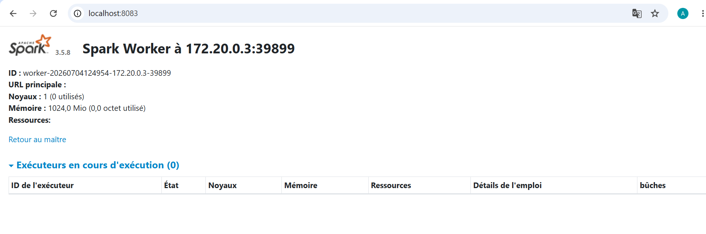
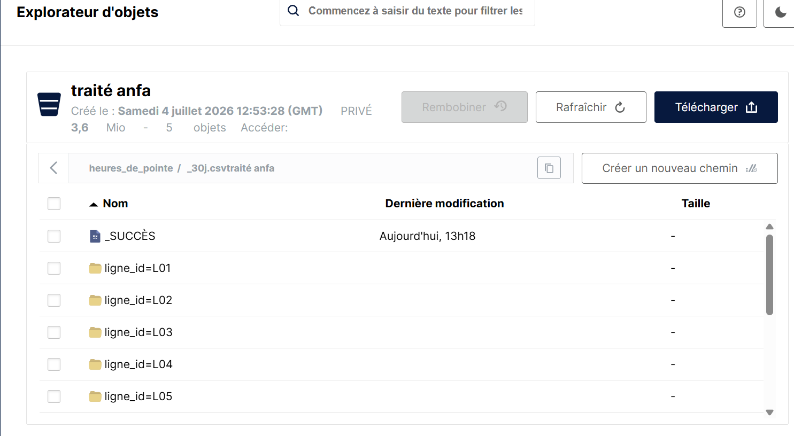
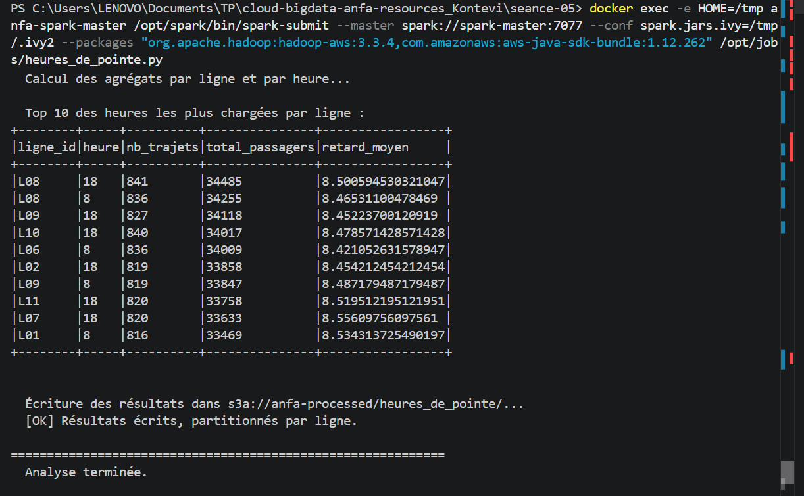
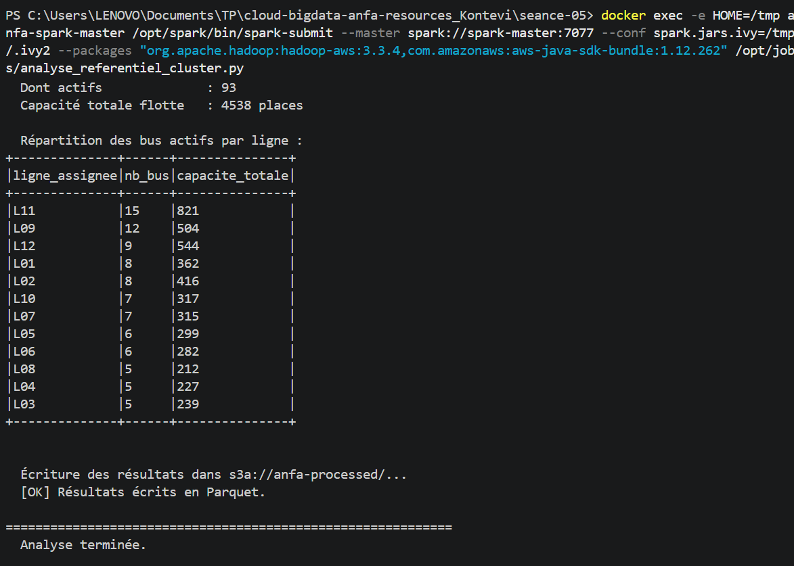

# Rendu Séance 5
**Nom et prénom :** KONTEVI Akossiwa Anne
## Résumé de la séance
Tous les jobs Spark ont été exécutés avec succès sur le cluster :

Analyse du référentiel : 12 lignes de bus analysées, 93 bus actifs sur 100, capacité totale de 4538 places, résultats écrits dans s3a://anfa-processed/.

Génération des trajets : 79 368 trajets générés sur 30 jours, stockés dans s3://anfa-raw/trajets/trajets_30j.csv.

Analyse des heures de pointe : Les lignes L08 et L09 sont les plus chargées aux heures de pointe (8h et 18h), résultats écrits dans s3a://anfa-processed/heures_de_pointe/.

Le cluster a été arrêté proprement avec docker compose down.

## Étapes principales
1. Déploiement du cluster Spark standalone (1 master + 2 workers) via Docker Compose.
2. Préparation de MinIO et upload du référentiel.
3. Premier job distribué (`analyse_referentiel_cluster.py`) : statistiques de base.
4. Génération d'un historique simulé de trajets et job d'analyse des heures de pointe.
5. Comparaison subjective entre mode local et mode cluster.
## Captures d'écran
### Dashboard Spark Master avec 2 workers

### Application Spark exécutée avec succès

### Résultats du Top 10 dans la console

### Bucket anfa-processed avec heures_de_pointe partitionné
