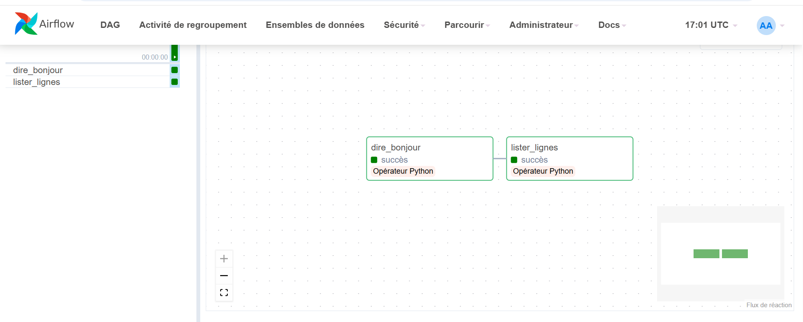
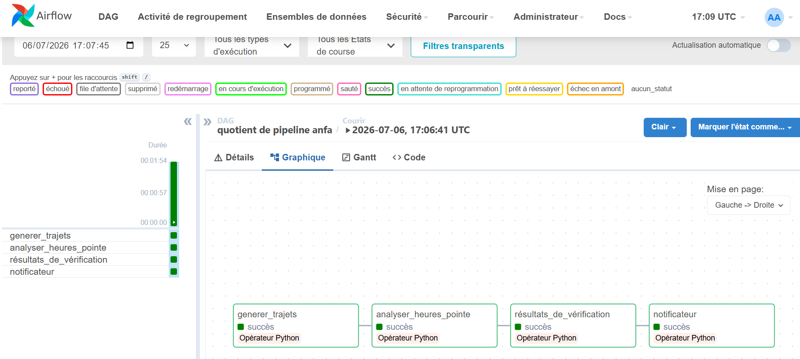
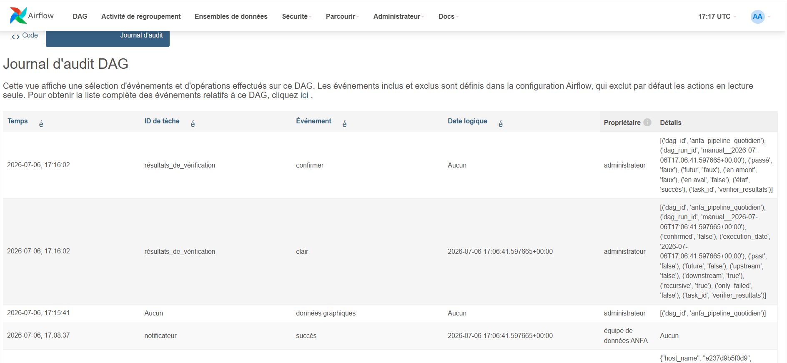
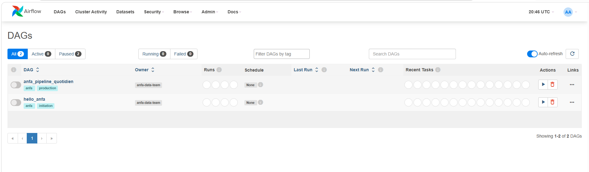

# Rendu : Séance 6

**Nom et prénom :** Denis AKPAGNONITE
**Identifiant GitHub :** anne486
**Date de soumission :** <03/07/2026>

## Résumé de la séance

Airflow déployé via Docker Compose aux côtés de MinIO et Spark. Un premier DAG
simple (`hello_anfa`) a servi à comprendre la mécanique, puis un DAG métier
(`anfa_pipeline_quotidien`) orchestre le pipeline de la séance 5 :
génération → analyse Spark → vérification → notification. Les retries et la
propagation d'échec ont été observés via un bug volontaire.

## Étapes principales

1. Déploiement de la stack (Airflow + PostgreSQL + MinIO + Spark) via Docker Compose.
2. Premier DAG `hello_anfa` à 2 tâches : initiation à la mécanique Airflow.
3. DAG métier `anfa_pipeline_quotidien` à 4 tâches : génération → Spark → vérification → notification.
4. Démonstration des retries et de la gestion d'erreur via un bug volontaire.

## Captures d'écran

### UI Airflow après connexion (vue d'accueil)

### DAG hello_anfa exécuté en succès

### DAG anfa_pipeline_quotidien complet en succès

### Logs de la tâche `verifier_resultats`

### Démonstration du retry : tâche en échec et propagation

## Réflexion personnelle

Airflow offre bien plus qu'un simple cron en permettant de définir des workflows composés de plusieurs tâches avec des dépendances, des reprises automatiques en cas d'échec, un suivi des exécutions et une interface web de supervision. Contrairement à cron, il facilite l'orchestration de pipelines complexes et leur surveillance. Dans un projet réel, Airflow est particulièrement adapté aux traitements de données (ETL/ELT), aux pipelines de Big Data ou de Machine Learning, ainsi qu'aux processus nécessitant une planification, une fiabilité et une traçabilité des exécutions.

## Difficultés rencontrées

<Aucune | Décrivez brièvement.>
