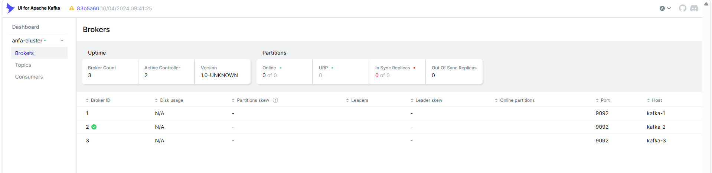
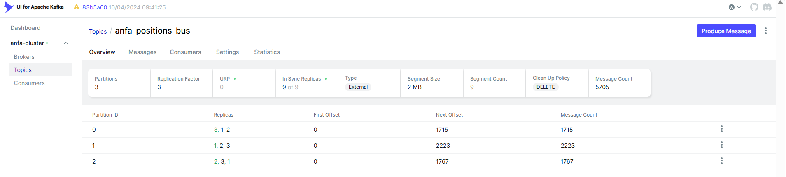
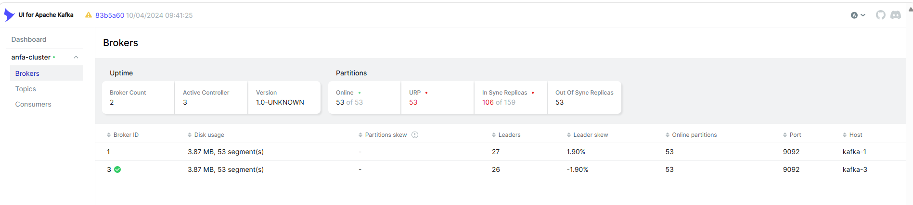
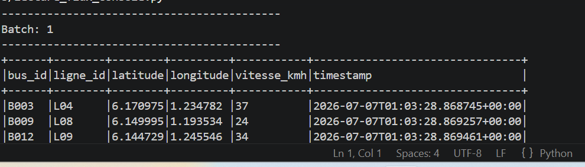
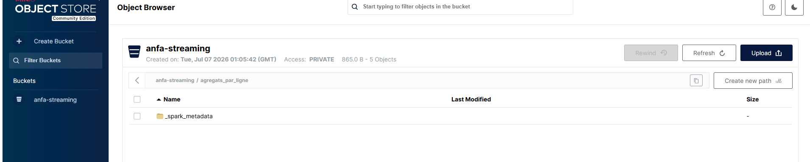

# Rendu — Séance 7

**Nom et prénom :** KONTEVI Akossiwa Anne
**Identifiant GitHub :** anne486
**Date de soumission :** 07/07/2026

## Résumé de la séance

Au cours de cette séance, nous avons déployé un cluster Kafka composé de 3 brokers en mode KRaft, accompagné de Kafka UI pour superviser son fonctionnement. Nous avons ensuite simulé une flotte de 100 bus envoyant leurs positions GPS en continu, puis consommé ces données avec Spark Structured Streaming afin de calculer des agrégats en temps réel avant de les stocker dans MinIO. Enfin, nous avons vérifié la tolérance aux pannes du cluster en arrêtant volontairement un broker.

## Étapes principales

1. Déploiement du cluster Kafka (3 brokers, mode KRaft) + Kafka UI.
2. Création du topic `anfa-positions-bus` (3 partitions, réplication 3).
3. Premier producer/consumer Python pour comprendre la mécanique.
4. Simulation de 100 bus envoyant leur position en continu.
5. Démonstration de tolérance aux pannes (arrêt d'un broker).
6. Spark Structured Streaming : lecture console, puis agrégation en fenêtre vers MinIO.

## Captures d'écran

### 3 brokers actifs dans Kafka UI

### Débit de messages en augmentation

### Cluster avec 2 brokers sur 3 (après arrêt volontaire)

### Micro-batchs affichés en console par Spark

### Résultats agrégés dans MinIO

## Réflexion personnelle

J'utiliserais Kafka associé à Spark Structured Streaming lorsqu'il est nécessaire de traiter des données en temps réel, par exemple pour le suivi GPS de véhicules, la détection de fraude ou la supervision d'équipements connectés. À l'inverse, un pipeline Airflow + Spark est davantage adapté aux traitements planifiés sur des données déjà stockées, comme les rapports quotidiens ou les analyses périodiques.

La réplication sur 3 brokers m'a montré qu'un cluster Kafka reste opérationnel même lorsqu'un broker tombe en panne. Les producteurs et consommateurs continuent à échanger des messages grâce aux répliques présentes sur les autres brokers, ce qui améliore fortement la disponibilité et la fiabilité du système.

## Réponses aux exercices d'application

<À compléter d'après les énoncés fournis avec l'assignment.>

## Difficultés rencontrées

aucune