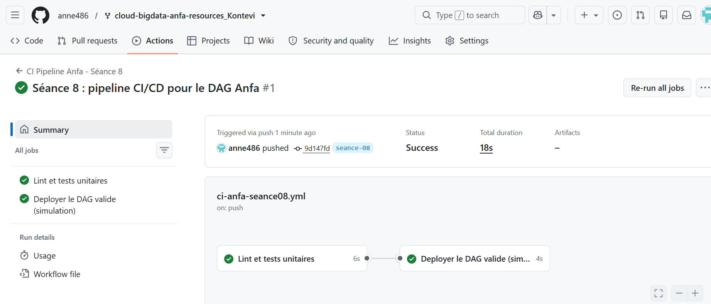
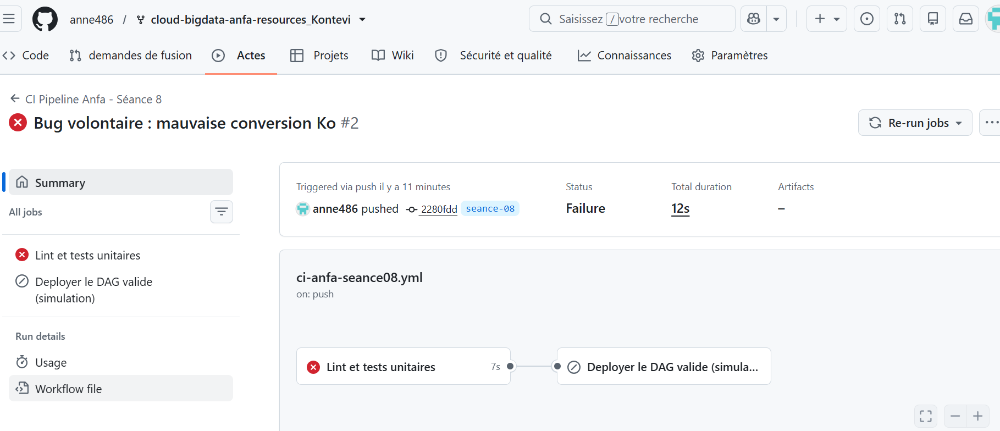

# Rendu — Séance 8

**Nom et prénom :** <Votre nom complet>
**Identifiant GitHub :** <votre-username>
**Date de soumission :** <JJ/MM/AAAA>

## Résumé de la séance

<2-4 lignes : logique métier séparée et testée, pipeline CI/CD GitHub Actions
écrit, démonstration d'un test bloquant le déploiement.>

## Étapes principales

1. Séparation de la logique métier (`anfa_logic.py`) du DAG Airflow.
2. Écriture de 5 tests unitaires avec pytest.
3. Écriture du workflow GitHub Actions (lint + tests + déploiement simulé).
4. Démonstration : un bug volontaire bloque le déploiement ; correction et succès.

## Captures d'écran

### Workflow réussi (2 jobs)

### Job en échec, déploiement non exécuté

## Réflexion personnelle

<3-5 lignes : en quoi ce pipeline aurait-il empêché l'incident de Mawuli
(situation-problème du CM) ? Qu'est-ce que `needs:` change concrètement ?>

## Difficultés rencontrées

<Aucune | Décrivez brièvement.>
