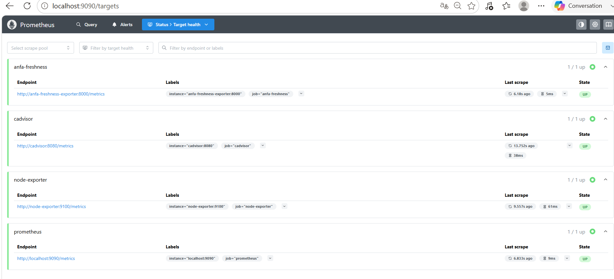
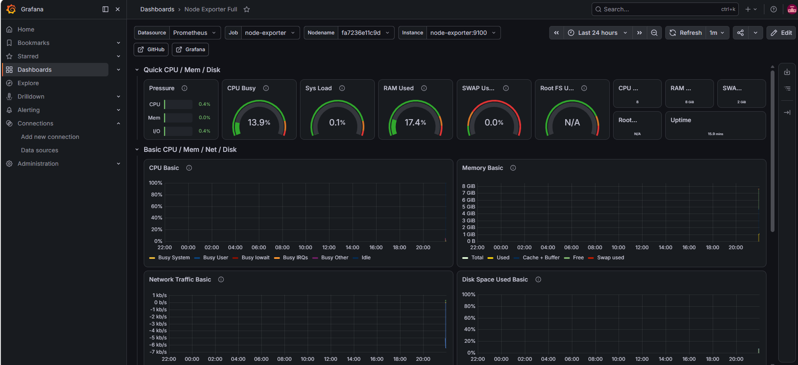
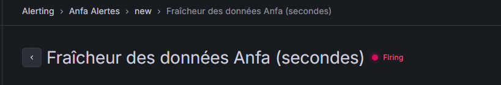

# Rendu — Séance 9

**Nom et prénom :** <Votre nom complet>
**Identifiant GitHub :** <votre-username>
**Date de soumission :** <JJ/MM/AAAA>

## Résumé de la séance

<2-4 lignes : stack Prometheus/Grafana déployée, exportateur de fraîcheur Anfa
instrumenté, dashboard construit, alerte configurée et déclenchée sur panne simulée.>

## Étapes principales

1. Déploiement de Prometheus, Node Exporter, cAdvisor, Grafana et d'un exportateur
   métier custom (fraîcheur des données Anfa).
2. Exploration des cibles Prometheus et premières requêtes PromQL.
3. Import du dashboard "Node Exporter Full" et construction d'un panneau custom.
4. Configuration d'une alerte Grafana sur la fraîcheur des données.
5. Simulation d'une panne silencieuse et observation du déclenchement de l'alerte.

## Captures d'écran

### Les 4 cibles Prometheus à l'état UP

### Dashboard "Node Exporter Full" importé

### Alerte à l'état Firing après panne simulée

## Réflexion personnelle

<3-5 lignes : en quoi cette séance répond-elle directement à la situation-problème
d'Awa dans le CM ? Qu'est-ce que la métrique de fraîcheur vous a permis de voir que
les autres métriques (CPU, RAM, statut des conteneurs) ne montraient pas ?>

## Difficultés rencontrées

<Aucune | Décrivez brièvement.>
